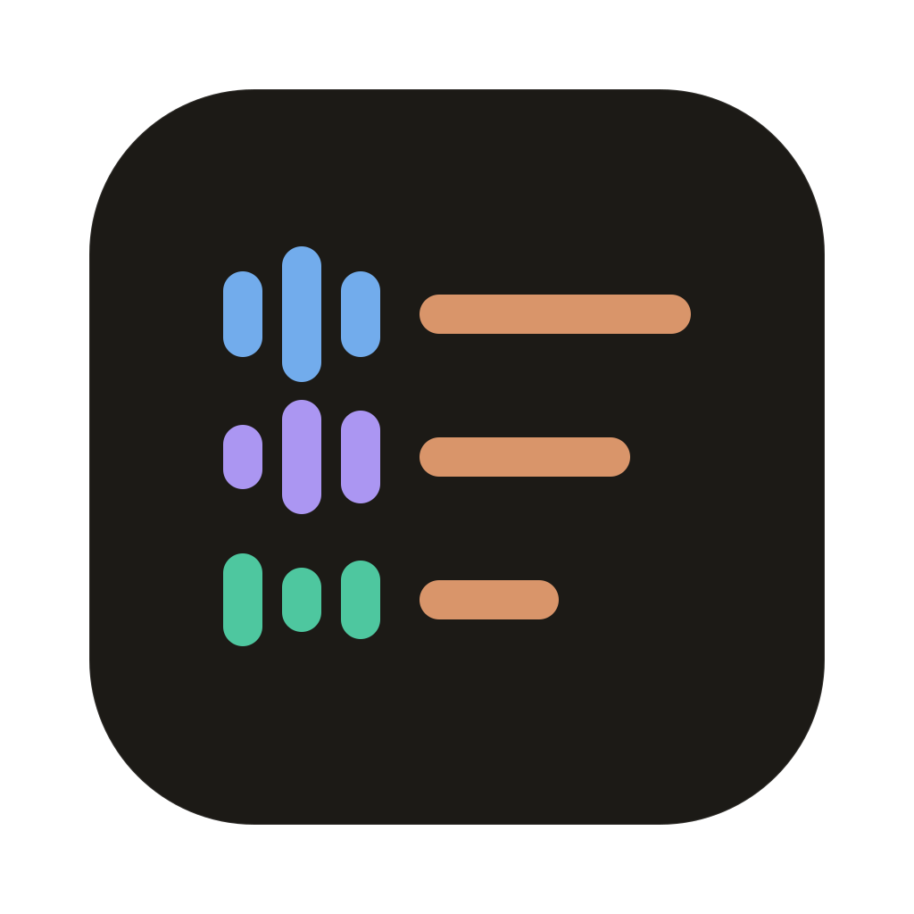

<div align="center">



# snastro

**Your recordings, transcribed, attributed and summarized, without leaving your laptop.**

Drop in a meeting recording and get back who said what, with names that stick across recordings,
plus a summary of decisions, open questions and action items where every point cites its source.
Everything runs on-device. No cloud, no API keys, no audio uploaded anywhere.

`Kotlin` · `Compose Desktop` · `sherpa-onnx` · `llama.cpp` · `SQLite` · `100% local` · `Apache-2.0`

</div>

---

## Why

Most meeting-transcription tools make you choose between convenience and privacy. snastro keeps the
convenience and drops the upload. You get:

- **Speaker diarization that remembers people.** Name a voice once and snastro proposes that
  person in the next recording of the same project. It doesn't show a fake-precise percentage: it
  gives a `strong / weak / none` band and ~10 seconds of audio so you can check by ear.
- **Real multilingual speech.** Italian and English in the same sentence (code-switching) are
  handled as normal input, not as an error.
- **Summaries you can check.** Every decision, action item and key point links back to the
  transcript segments it came from. Before anything is shown, the model's citations are checked,
  and a claim with no valid source is dropped, never presented as fact.
- **Your data stays yours.** Voice prints are biometric data, so they're stored locally, scoped to
  one project, and deleting a person purges every print while past documents keep their name.

## What it does

```
 ┌─────────────┐   ┌──────────────────────────────────────────┐   ┌───────────────┐
 │ Recording   │──▶│ decode ▸ separate voices ▸ transcribe ▸  │──▶│ Transcript    │
 │ (m4a, wav…) │   │ align per turn            (sherpa-onnx)  │   │ + voices      │
 └─────────────┘   └──────────────────────────────────────────┘   └──────┬────────┘
                                                                         │
            ┌────────────────────────────────────────────────────────────┤
            ▼                                                            ▼
 ┌──────────────────────┐   ┌──────────────────────┐        ┌───────────────────────┐
 │ Speakers             │   │ Markdown document    │        │ Summary (local LLM)   │
 │ voice prints, per-   │──▶│ "who says what",     │        │ decisions · open      │
 │ project gallery      │   │ regenerated on edit  │        │ questions · actions · │
 └──────────────────────┘   └──────────────────────┘        │ key points + sources  │
                                                            └───────────────────────┘
```

1. **Create a project** and add recordings you already have.
2. **Transcribe.** You can optionally say how many people speak (1–10). Otherwise clustering is automatic.
3. **Review.** Fix diarization mistakes: merge two voices, split one, move a sentence to
   another voice. You can also use *reassign by similarity*, which previews the moves before
   applying them.
4. **Name the speakers.** For each voice, snastro ranks candidates from the project's gallery.
   Recurring people come first, and one-off guests are kept and can be promoted later.
5. **Read.** A Markdown document per recording is regenerated whenever names or structure change.
6. **Summarize.** You can give a topic, and anything off-topic is left out of the summary.

## Under the hood

Every model is downloaded on first run from a **pinned URL with a verified SHA-256**. The app never
bundles unverified weights, and an in-app screen lists every model's licence and attribution.

| Role | Model | Licence |
|---|---|---|
| Speech recognition | NVIDIA Parakeet TDT 0.6B v3 (int8, ONNX by k2-fsa) | CC-BY-4.0 |
| Segmentation | pyannote segmentation-3.0 | MIT |
| Speaker embeddings | WeSpeaker ResNet34-LM · NeMo TitaNet-small | CC-BY-4.0 |
| Voice activity | Silero VAD | MIT |
| Summaries *(optional, ~6.2 GB)* | Qwen3.5 9B Q4_K_M (GGUF) | Apache-2.0 |

- **ML runtime:** [sherpa-onnx](https://github.com/k2-fsa/sherpa-onnx) in-process via JNI (CPU).
- **LLM runtime:** [llama.cpp](https://github.com/ggml-org/llama.cpp) in-process through our own JNI
  shim, packaged as the standalone `:llama-jni` library, with Metal on all layers. The model is
  loaded per summary and unloaded afterwards, so it doesn't sit in RAM.
- **Budget:** a 1-hour recording is summarized in about 3 minutes on an Apple M3 Pro. The context is sized to
  each input, up to the model's native 262k tokens.
- **Audio:** FFmpeg via JavaCV (LGPL build).
- **Storage:** SQLite through SQLDelight. Every project is a self-contained folder.

## Architecture

snastro is a **hexagonal modular monolith** built with Domain-Driven Design. Each bounded context gets its
own `dominio / applicazione / adattatori` Gradle modules, and the ubiquitous language is
Italian, the language of the domain. That's why you'll see `Registrazione`, `Parlante` and `Riassunto`
in the code.

| Context | Owns |
|---|---|
| `progetto` | Projects and their recordings |
| `trascrizione` | Processing runs, transcripts, voices, segments, review |
| `parlanti` | People, voice prints, the gallery, attribution proposals |
| `documento` | The Markdown projection (owns no source of truth) |
| `sintesi` | Summaries and source verification |

Technical modules sit around the contexts: `kernel`, `persistenza`, `audio`, `ml-sherpa`,
`modelli`, `llama-jni`, `supporto`, `ui`, and `avvio`, which is the composition root.

The architecture is **enforced by the build**, not just described in documents:

- `verificaDipendenzeModuli` fails the build on any project-to-project edge that isn't in the
  allowed-edges table.
- [Konsist](https://github.com/LemonAppDev/konsist) tests guard package rules and naming.
- ADRs with mechanical constraints ship with an executable check (`architettura-test/controlli-adr/`).
- detekt runs with warnings as errors.

The design record lives in [`.mismagent/`](.mismagent). It holds the [architecture](.mismagent/architecture.md),
the [context map](.mismagent/context-map.md) with the ubiquitous language, the
[code rules](.mismagent/code-rules.md), and 30 [ADRs](.mismagent/decisions).

## Getting started

**Requirements:** macOS on Apple Silicon (the only host wired and verified today), JDK 21 (Gradle's
toolchain provisions it), a C toolchain (`clang`) for the llama.cpp JNI shim, and about 1 GB of disk for the
transcription models, plus about 6 GB if you enable summaries.

```bash
# run the app (fetches and verifies the native libraries on first run)
./gradlew :avvio:run

# the full quality gate: compile, detekt, unit/contract/architecture tests,
# Compose UI render checks. Headless, no model weights, no natives.
./gradlew check

# opt-in: contract tests against the real ML models and FFmpeg
./gradlew modelliTest
```

App data, logs and downloaded models live under `~/Library/Application Support/snastro/`.

## Status

snastro is under active development. On macOS arm64 it works end to end: transcription with speakers,
review, cross-recording identification and local summaries. The llama.cpp binding already targets
Windows x64 and Linux x64 (Vulkan with a CPU fallback). The app itself on those platforms is still
blocked by native packaging and code signing decisions.

## Acknowledgements

snastro relies on the work of the teams behind sherpa-onnx (k2-fsa), llama.cpp (ggml-org),
pyannote, WeSpeaker, NVIDIA NeMo, Silero, Qwen, FFmpeg, JetBrains Compose Multiplatform and
SQLDelight. The in-app *Licenze dei modelli e librerie* screen has the full attributions.

## License

snastro is released under the [Apache License 2.0](LICENSE). The model weights aren't part of this
repository: the app downloads them on first use, and each keeps its own licence (MIT, CC-BY-4.0 or
Apache-2.0, all of which allow commercial use). The CC-BY-4.0 models require attribution, which is in
[`NOTICE`](NOTICE) and in the app's licences screen.
